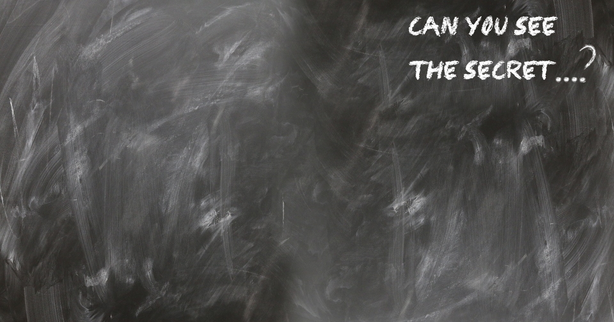
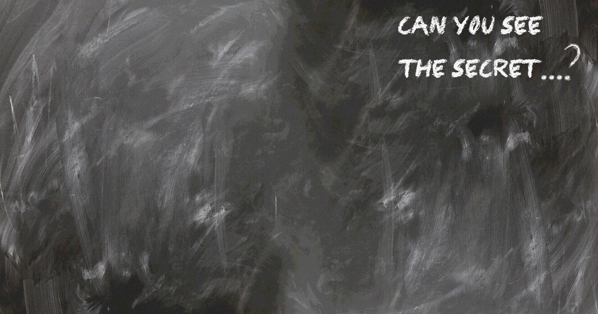
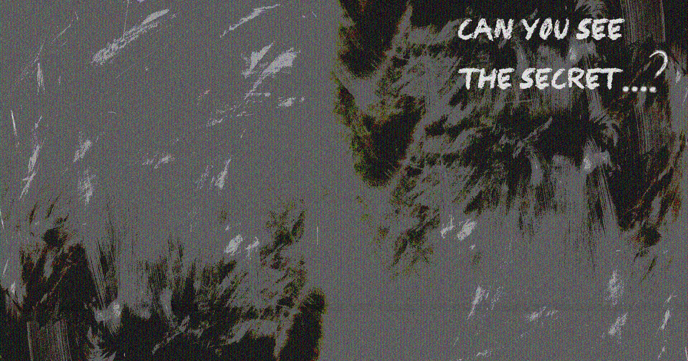

# LSB steganography

Steganography is the practice of concealing data (the secret) inside other data (cover) such that the hidden data cannot be noticed by an unaware party. In the presentation, we demonstrated the application of LSB steganography, where the secret data is encoded into and communicated in one or several least significant bits of the cover image. This could the least significant bits of the pixel's values of the cover image, defined as spatial domain steganography. 

.png)

Alternatively, there are images formats such JPEG, where the image is represented by frequencies, using one of several possible transforms (DCT, DWT, etc). When the LSBs of the secret message are embedded in coefficients of frequencies of the cover image, it is defined as frequency domain steganography. 

During the presentation, we secretly embedded the content of six books in the background of the live presentation.

This the cover image: 

It can be seen that the cover image is gradually distorted with embedding of the secret data:

Finally, with the embedding of the 6 books into more significant bits the distortion is noticeable:

